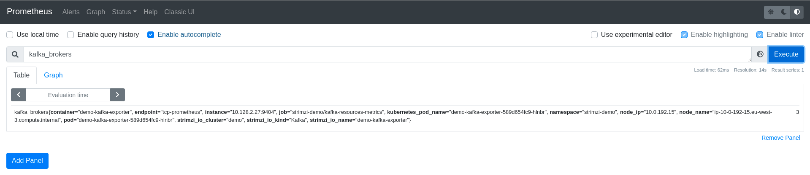

# Strimzi Demo

This repository has a sample demo to deploy an Apache Kafka cluster using
[Strimzi Apache Kafka Operator](https://operatorhub.io/operator/strimzi-kafka-operator) and
some simple applications producing and consuming messages there.

The Apache Kafka cluster will be monitored using a [Prometheus](https://prometheus.io/)
and [Grafana](https://grafana.com/) instance managed by:

* [Prometheus Operator](https://operatorhub.io/operator/prometheus): This operator creates and manages Prometheus
instances to monitor services in a namespace.
* [Grafana Operator](https://operatorhub.io/operator/grafana-operator): This operator creates and manages
Grafana instances, import Data Sources and Dashboards.

## Prepare OpenShift

This demo has been tested in Red Hat OpenShift Container Platform 4.7 version.

This version has deployed the Operator Lifecycle Manager (OLM), tool to help manage the
Operators running on a cluster.

As a normal user in your OpenShift cluster, create a ```strimzi-demo``` namespace:

```shell script
❯ oc login -u user
❯ oc new-project strimzi-demo
```

**NOTE:** To deploy the different Operators we need to use an user with ```cluster-admin``` role.

```shell script
oc login -u admin-user
```

### Deploy Strimzi Operator

Install the latest version of the operator running the following command:

```shell script
oc create -f strimzi-operator/strimzi-kafka-operator.yaml
```

The Strimzi Operator will be installed in the ```openshift-operators``` namespace and will be usable
from any namespaces in the cluster.

```shell script
❯ oc get pod -n openshift-operators
NAME                                                READY   STATUS    RESTARTS   AGE
strimzi-cluster-operator-v0.23.0-5f6d486bf7-jqd5v   1/1     Running   0          26h
```

### Deploy Prometheus and Grafana Operators

Strimzi supports Prometheus metrics using Prometheus JMX exporter to convert the JMX metrics supported
by Apache Kafka and Apache Zookeeper to Prometheus metrics. This feature helps us to monitor the cluster
easily using Prometheus to store the metrics and Grafana Dashboards to expose them.

This repo will use [Prometheus Operator](https://operatorhub.io/operator/prometheus) and
[Grafana Operator](https://operatorhub.io/operator/grafana-operator) to deploy them and monitor the
Apache Kafka ecosystem easily.

To get detailed configuration, please, review the
[Introducing Metrics to Kafka](https://strimzi.io/docs/operators/latest/deploying.html#assembly-metrics-str)
from Strimzi Documentation site.

**NOTE:** To deploy Prometheus and Grafana Operators we need to install previously an `OperatorGroup` to match the
Operator's installation mode and the namespace. This step is describe in
[Adding Operators to a cluster](https://docs.openshift.com/container-platform/4.7/operators/admin/olm-adding-operators-to-cluster.html)
page from [OpenShift Documentation](https://docs.openshift.com/container-platform/4.7/welcome/index.html) site.

```shell script
oc apply -f metrics/operator-group.yaml
```

Now we could deploy the subscriptions for each operator as:

Deploying Prometheus Operator in ```strimzi-demo``` namespace:

```shell script
oc apply -f metrics/prometheus/operator/prometheus-operator.yaml
```

Deploying Grafana Operator in ```strimzi-demo``` namespace:

```shell script
oc apply -f metrics/grafana/operator/grafana-operator.yaml
```

After some minutes we could check these operators are installed and available:

```shell script
❯ oc get csv
NAME                               DISPLAY               VERSION   REPLACES                           PHASE
grafana-operator.v3.10.1           Grafana Operator      3.10.1    grafana-operator.v3.10.0           Succeeded
prometheusoperator.0.47.0          Prometheus Operator   0.47.0    prometheusoperator.0.37.0          Succeeded
strimzi-cluster-operator.v0.23.0   Strimzi               0.23.0    strimzi-cluster-operator.v0.22.1   Succeeded
```

As soon the operators are installed we could follow to install the Metrics Platform and the Apache Kafka Cluster.

## Deploy Metrics Platform

Prometheus and Grafana Operator help us to deploy our local Prometheus Server and Grafana instance where
we could manage the metrics from our Apache Kafka Cluster.

To deploy a local Prometheus Server in ```strimzi-demo``` namespace.

```shell script
❯ oc apply -f metrics/prometheus/prometheus-additional.yaml
❯ oc apply -f metrics/prometheus/strimzi-pod-monitor.yaml
❯ oc apply -f metrics/prometheus/prometheus-rules.yaml
❯ oc apply -f metrics/prometheus/prometheus.yaml
```

A Prometheus instance will be available with a service and a route:

```shell script
❯ oc get svc
NAME                  TYPE        CLUSTER-IP       EXTERNAL-IP   PORT(S)    AGE
prometheus-operated   ClusterIP   None             <none>        9090/TCP   34s
❯ oc get route
NAME        HOST/PORT                                                  PATH   SERVICES             PORT   TERMINATION   WILDCARD
prometheus  prometheus-strimzi-demo.apps.labs.sandbox1862.opentlc.com         prometheus-operated  web                  None
```

To get the route to access Prometheus:

```shell script
oc get route prometheus -o jsonpath='{.spec.host}'
```

The Prometheus Dashboard will be similar to:



Deploy Grafana:

```shell script
oc apply -f metrics/grafana/grafana.yaml
```

Grafana will deploy a Data Source connected to the Prometheus server available by Prometheus
in the endpoint ```http://prometheus-operated:9090```. The Grafana Server will use that Data Source
to get the metrics.

Grafana has a set of dashboards to review the metrics from Apache Zookeeper and Apache Kafka Cluster. We could
deploy it as:

```shell script
oc apply -f metrics/grafana/dashboards/
```

To get the route to access Grafana:

```shell script
oc get route grafana-route -o jsonpath='{.spec.host}'
```

Use the original credentials **root/secret** as user/password. These credentials are defined in the
[Grafana CR](./metrics/grafana/grafana.yaml) file.

Grafana Dashboards will be displayed in Grafana as:


## Deploy and use a Kafka Cluster

We change to use a non-cluster-admin user to deploy our metrics platform.

```shell script
oc login -u user
```

**NOTE:** This section will be executed with non-cluster-admin user.

We change to use a non-cluster-admin user to deploy our metrics platform.

### Deploy Kafka Cluster

Apache Kafka cluster is deployed using the custom resource in [kafka-cluster.yaml](./strimzi-cr/kafka-cluster.yaml) file:

```shell script
❯ oc create -f strimzi-cr/configmap/
❯ oc create -f strimzi-cr/kafka-cluster.yaml
```

After some minutes the Apache Kafka Cluster is deployed with the following set of pods:

```shell script
❯ oc get pod
NAME                                    READY   STATUS      RESTARTS   AGE
demo-cruise-control-7b7f66f595-7c2qh    2/2     Running     0          24h
demo-entity-operator-7c75c6b885-bz4cj   3/3     Running     0          27h
demo-kafka-0                            1/1     Running     0          24h
demo-kafka-1                            1/1     Running     0          4h18m
demo-kafka-2                            1/1     Running     0          24h
demo-kafka-exporter-589d654fc9-hlnbr    1/1     Running     2          26h
demo-zookeeper-0                        1/1     Running     0          24h
demo-zookeeper-1                        1/1     Running     0          24h
demo-zookeeper-2                        1/1     Running     0          24h
```

## Deploy Kafka Topic

A Kafka Topic is created using the custom resource in [kafka-topic.yaml](./strimzi-cr/kafka-topic.yaml) file:

```shell script
oc create -f strimzi-cr/kafka-topic.yaml
```

This custom resource will create the topic ```greetings```:

```shell script
❯ oc get kafkatopic
NAME       CLUSTER   PARTITIONS   REPLICATION FACTOR   READY
greetings  demo      3            2                    True
```

## Deploy Kafka User

A Kafka User is created using the custom resource in [kafka-user.yaml](./strimzi-cr/kafka-user.yaml) file:

```shell script
oc create -f strimzi-cr/kafka-user.yaml
```

This custom resource will create the user ```user-demo```:

```shell script
❯ oc get kafkauser
NAME        CLUSTER   AUTHENTICATION   AUTHORIZATION   READY
user-demo   demo      tls              simple          True
```
## Deploy Producer and Consumer

To test the Apache Kafka cluster we will deploy some jobs to produce and consume messages using the
plain connection protocol:

This producer will send a set of messages to the topic ```greetings```:

```shell script
oc create -f sample-apps/job-sample-producer.yaml
```

This consumer will consume messages from each partition of the ```greetings``` topic:

```shell script
oc create -f sample-apps/job-sample-consumer.yaml
```

You could check the status of the jobs or pods with the commands

```shell script
❯ oc get job
NAME                  COMPLETIONS   DURATION   AGE
sample-consumer-job   3/3           85s        4m52s
sample-producer-job   1/1           2m7s       4m52s
```

## Grafana Dashboards

A sample of the Grafana Kafka Dashboard when the consumers and producers are working could
be similar to:


The Zookeeper Dashboard could be similar to:


The Kafka Exporter Dashboard could be similar to:


The Kafka Cruise Control Dashboard could be similar to:


The Strimzi Operators Dashboard could be similar to:


## References

Strimzi:

* [Strimzi Overview guide](https://strimzi.io/docs/operators/latest/overview.html)
* [Using Strimzi](https://strimzi.io/docs/operators/latest/using.html)
* [Deploying and Upgrading](https://strimzi.io/docs/operators/latest/deploying.html)
* [Apache Kafka Client Examples](https://github.com/strimzi/client-examples)

Apache Kafka:

* [Apache Kafka](https://kafka.apache.org/)
