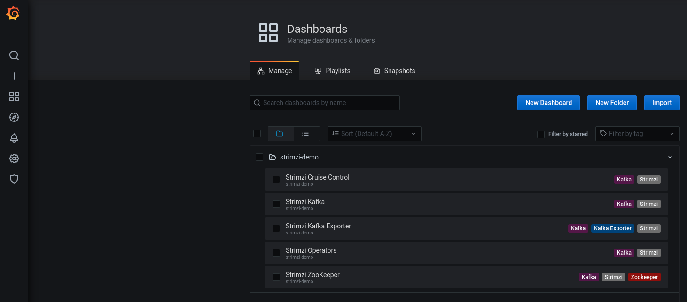
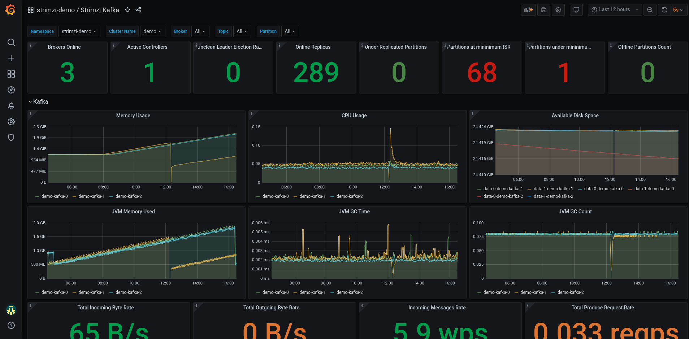

# Strimzi Demo

This repos has a sample demo to deploy an Apache Kafka cluster using [Strimzi Apache Kafka Operator](https://operatorhub.io/operator/strimzi-kafka-operator). The Apache Kafka cluster will expose metrics to Prometheus and
Grafana dashboards managed by:

* [Prometheus Operator](https://operatorhub.io/operator/prometheus): This operator creates and manages Prometheus
instances to monitor services in a namespace.
* [Grafana Operator](https://operatorhub.io/operator/grafana-operator): This operator creates and manages
Grafana instances, import Grafana datasources and import Grafana Dashboards.

## Prepare OpenShift

This demo has been tested in Red Hat OpenShift Container Platform 4.2 version.

This version has deployed the Operator Lifecycle Manager (OLM), tool to help manage the
Operators running on a cluster.

As a normal user in your OpenShift cluster, create a ```strimzi-demo``` namespace:

```bash
oc login -u user
oc new-project strimzi-demo
```

**NOTE:** To deploy the different Operators we need to use an user with ```cluster-admin``` role.

```bash
oc login -u admin-user
```

### Deploy Strimzi Operator

Install the latest version of the operator running the following command:

```bash
oc create -f strimzi-operator/strimzi-kafka-operator.yaml
```

The Strimzi Operator will be installed in the ```openshift-operators``` namespace and will be usable
from any namespaces in the cluster.

### Deploy Prometheus and Grafana Operators

Strimzi supports Prometheus metrics using Prometheus JMX exporter to convert the JMX metrics supported
by Apache Kafka and Apache Zookeeper to Prometheus metrics. This feature helps us to monitor the cluster
easily using Prometheus to store the metrics and Grafana Dashboards to expose them.

This repo will use [Prometheus Operator](https://operatorhub.io/operator/prometheus) and
[Grafana Operator](https://operatorhub.io/operator/grafana-operator) to deploy them and monitor the
Apache Kafka ecosystem easily.

To get detailed configuration, please, review the [Appendix C: Metrics](https://strimzi.io/docs/latest/#assembly-metrics-setup-str) from Strimzi Documentation site.

**NOTE:** To deploy Prometheus and Grafana Operators we need to install previously an OperatorGroup to match the
Operator's installation mode and the namespace. This step is describe in [Adding Operators to a cluster](https://docs.openshift.com/container-platform/4.2/operators/olm-adding-operators-to-cluster.html) page from
[OpenShift 4.2 Documentation](https://docs.openshift.com/container-platform/4.2/welcome/index.html) site

```bash
oc apply -f metrics/operator-group.yaml
```

Now we could deploy the subscriptions for each operator as:

Deploying Prometheus Operator in ```strimzi-demo``` namespace:

```bash
oc apply -f metrics/prometheus/operator/prometheus-operator.yaml
```

Deploying Grafana Operator in ```strimzi-demo``` namespace:

```bash
oc apply -f metrics/grafana/operator/grafana-operator.yaml
```

After some minutes we could check these operators are installed and availables:

```bash
$ oc get csv
NAME                              DISPLAY                       VERSION  REPLACES                          PHASE
grafana-operator.v2.0.0           Grafana Operator              2.0.0    grafana-operator.v1.3.0           Succeeded
prometheusoperator.0.32.0         Prometheus Operator           0.32.0   prometheusoperator.0.27.0         Succeeded
strimzi-cluster-operator.v0.14.0  Strimzi Apache Kafka Operator 0.14.0   strimzi-cluster-operator.v0.13.0  Succeeded
```

As soon the operators are installed we could follow to install the Metrics Platform and the Apache Kafka Cluster

## Deploy Metrics Platform

Prometheus and Grafana Operator help us to deploy our local Prometheus Server and Grafana instance where
we could manage the metrics from our Apache Kafka Cluster.

To deploy a local Prometheus Server in ```strimzi-demo``` namespace.

```bash
oc create secret generic additional-scrape-configs --from-file=metrics/prometheus/prometheus-additional.yaml
oc apply -f metrics/prometheus/strimzi-service-monitor.yaml
oc apply -f metrics/prometheus/prometheus-rules.yaml
oc apply -f metrics/prometheus/prometheus.yaml
```

A Prometheus instance will be available with a service and a route:

```bash
$ oc get svc
NAME                  TYPE        CLUSTER-IP       EXTERNAL-IP   PORT(S)    AGE
prometheus            ClusterIP   172.30.224.132   <none>        9090/TCP   65s
prometheus-operated   ClusterIP   None             <none>        9090/TCP   65s
$ oc get route prometheus -o jsonpath='{.spec.host}'
prometheus-strimzi-demo40.apps.dev.sandbox1249.opentlc.com
```

The Prometheus Dashboard will be similar to:


Deploy Grafana:

```bash
oc apply -f metrics/grafana/grafana.yaml
```

Grafana will deploy a Datasource connected to the Prometheus server available by Promtheus
in the endpoint ```http://prometheus-operated:9090```. The Grafana Server will use that Datasource
to get the metrics.

Grafana has a set of dashboards to review the metrics from Apache Zookeeper and Apache Kafka Cluster. We could
deploy it as:

```bash
oc apply -f metrics/grafana/grafana-dashboard-strimzi-kafka.yaml
oc apply -f metrics/grafana/grafana-dashboard-strimzi-zookeeper.yaml
```

To get the route to access Grafana:

```bash
oc get route grafana-route -o jsonpath='{.spec.host}'
```

Use the original credentials **root/secret** as user/password. These credentials are defined in the
[Grafana CR](./metrics/grafana/grafana.yaml) file.

Grafana Dashaboards will be displayed in Grafana as:



## Deploy and use a Kafka Cluster

We change to use a non-cluster-admin user to deploy our metrics platform.

```bash
oc login -u user
```

**NOTE:** This section will be executed with non-cluster-admin user.

We change to use a non-cluster-admin user to deploy our metrics platform.

### Deploy Kafka Cluster

Apache Kafka cluster is deployed using the custom resource in [kafka-cluster.yaml](./strimzi-cr/kafka-cluster.yaml) file:

```bash
oc create -f strimzi-cr/kafka-cluster.yaml
```

After some minutes the Apache Kafka Cluster is deployed with the following set of pods:

```bash
$ oc get pod
NAME                                            READY     STATUS    RESTARTS   AGE
demo-cluster-entity-operator-789556fbdd-bwk54   3/3       Running   0          67s
demo-cluster-kafka-0                            2/2       Running   0          2m5s
demo-cluster-kafka-1                            2/2       Running   0          2m5s
demo-cluster-kafka-2                            2/2       Running   0          2m5s
demo-cluster-zookeeper-0                        2/2       Running   0          3m33s
demo-cluster-zookeeper-1                        2/2       Running   0          3m33s
demo-cluster-zookeeper-2                        2/2       Running   0          3m33s
```

## Deploy Kafka Topic

A Kafka Topic is created using the custom resource in [kafka-topic.yaml](./strimzi-cr/kafka-topic.yaml) file:

```bash
oc create -f strimzi-cr/kafka-topic.yaml
```

This custom resurce will create the topic ```greetings```:

```bash
$ oc get kafkatopic
NAME       PARTITIONS   REPLICATION FACTOR
greetings  3            2
```

## Deploy Producer and Consumer

To test the Apache Kafka cluster we will deploy some jobs to produce and consume messages using the
plain connection protocol:

This producer will send a set of messages to the topic ```greetings```:

```bash
oc create -f sample-apps/job-sample-producer.yaml
```

This consumer will consume messages from each partition of the ```greetings``` topic:

```bash
oc create -f sample-apps/job-sample-consumer.yaml
```

You could check the status of the jobs or pods with the commands

```bash
$ oc get job
NAME                  COMPLETIONS   DURATION   AGE
sample-consumer-job   3/3           104s       115s
sample-producer-job   1/1           116s       2m7s
```

## Deploy Secured Producer and Consumer

To test the Apache Kafka cluster we will deploy some jobs to produce and consume messages using the
secured connection protocol:

```bash
oc create -f sample-apps/job-ssl-sample-producer.yaml
```

This consumer will consume messages from each partition of the ```greetings``` topic:

```bash
oc create -f sample-apps/job-ssl-sample-consumer.yaml
```

## Grafana Dashboards

A sample of the Grafana Kafka Dashboard when the consumers and producers are working could
be similar to:



The Zookeeper Dashboard could be similar to:


